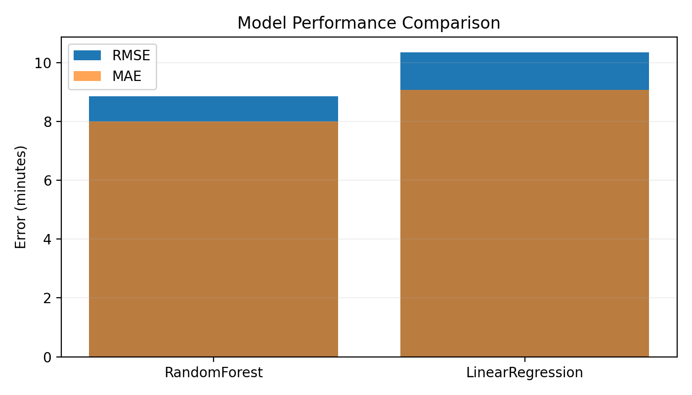
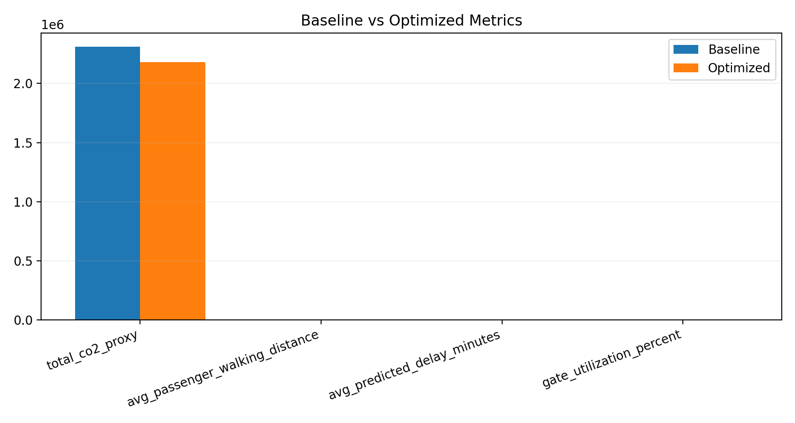

# Intelligent Airport Gate Assignment Using Machine Learning and Multi-Objective Optimization

**R. Balaji**  
Department of Computer Science, [Your University Name], [City, Country]  
[email@domain.com](mailto:email@domain.com)

## Abstract
Efficient airport gate assignment is essential for improving passenger transfer experience, aircraft turnaround reliability, and environmental performance in airport operations. Most classical Airport Gate Assignment Problem (AGAP) models are deterministic and optimize static schedules, which limits robustness under delay uncertainty. This paper proposes an intelligent predict-then-optimize AGAP framework that integrates machine learning delay prediction with multi-objective genetic optimization. Flight delay is predicted from operational features including arrival hour, aircraft class, passenger demand, taxi distance, and fuel burn rate. Predicted delay is then embedded in the optimization fitness function together with passenger walking distance, taxi distance, and CO2 proxy cost. Hard constraints enforce one-flight-one-gate assignment, gate-aircraft compatibility, gate-type feasibility, and temporal non-overlap at each gate. Experiments on a synthetic but operationally consistent airport dataset show that the optimized assignment reduces total CO2 proxy by 5.628% and average predicted delay by 0.829% relative to baseline random assignment, while revealing a trade-off in average passenger walking distance. The framework is transparent, scalable, and suitable for extension to real-time airport decision support.

## Keywords
Airport Gate Assignment Problem, AGAP, Machine Learning, Genetic Algorithm, Predict-Then-Optimize, Emission-Aware Optimization

## 1. Introduction
Airport gate assignment directly affects flight punctuality, passenger transfer quality, and airport-side environmental outcomes. As traffic density increases, gate assignment decisions must satisfy multiple constraints and objectives simultaneously. The AGAP is therefore a combinatorial optimization problem with strong operational coupling across gates, flights, and time windows.

Recent AGAP studies include passenger-centric and airport-centric objectives, while newer work adds emission-aware terms. However, many methods still assume deterministic schedules. In practice, delay uncertainty propagates through gate occupancy and can invalidate static allocations.

This paper addresses that limitation by integrating machine learning delay prediction into a constrained multi-objective gate assignment optimizer. The primary contribution is a unified predict-then-optimize framework that remains feasible under compatibility constraints while explicitly accounting for delay risk.

## 2. Literature Review
Early AGAP studies used linear and network formulations to reduce passenger walking and improve gate utilization. Subsequent work expanded toward mixed-integer optimization, robust scheduling, and metaheuristic methods. Genetic algorithms remain common for large assignment spaces because they balance search quality and runtime.

Recent literature introduced environmental perspectives, particularly taxi-related greenhouse-gas reductions. The original AGAP paper used in this project background (Bagioneta et al., 2025) combines apron minimization, passenger walking minimization, and emission-aware objectives with GA + Nash-equilibrium parameter control.

Despite these improvements, most formulations remain weakly integrated with predictive delay modeling. Delay is often handled by static buffers or scenario assumptions, not by a learned operational predictor embedded inside optimization.

## 3. Research Gap
Three gaps motivate this work.

First, existing AGAP models are largely deterministic and do not explicitly integrate learned delay uncertainty into assignment scoring.

Second, sustainability and operational robustness are often optimized separately rather than in a unified objective.

Third, several practical constraints highlighted in prior work, such as airline policy behavior and dynamic reassignment under disruption, are not fully operationalized in common student-scale prototypes.

The proposed framework narrows these gaps by embedding delay prediction directly into multi-objective optimization, while preserving strict feasibility constraints and reporting explicit trade-offs.

## 4. Problem Formulation
### 4.1 Sets
- \(F\): set of flights, indexed by \(f,h\)
- \(G\): set of gates, indexed by \(g\)
- \(\mathcal{O}\subseteq F\times F\): set of overlapping flight pairs, defined as  
  \[
  \mathcal{O}=\{(f,h)\mid a_f<d_h,\ a_h<d_f,\ f<h\}
  \]

### 4.2 Decision Variable
\[
x_{fg}=
\begin{cases}
1,& \text{if flight }f\text{ is assigned to gate }g,\\
0,& \text{otherwise.}
\end{cases}
\]

### 4.3 Parameters
- \(a_f, d_f\): arrival and departure times of flight \(f\)
- \(S_f, S_g\): aircraft-size class and gate-size class
- \(\tau_f, \tau_g\): flight type and gate type
- \(P_f\): expected passengers of flight \(f\)
- \(T_{fg}\): taxi-distance cost term if \(f\) is assigned to \(g\)
- \(W_{fg}\): walking-distance cost term if \(f\) is assigned to \(g\)
- \(r_f\): fuel-burn-rate proxy for flight \(f\)
- \(t_f\): baseline runway taxi-distance term for flight \(f\)
- \(d_g\): gate-to-runway distance for gate \(g\)
- \(\hat{y}_f\): predicted delay of flight \(f\) (minutes)
- \(\mathbf{1}[\cdot]\): indicator function, 1 if condition is true and 0 otherwise

## 5. Mathematical Model
The integrated multi-objective problem is:
\[
\min_{x} Z = w_1 C_{\text{walk}} + w_2 C_{\text{taxi}} + w_3 C_{\text{CO2}} + w_4 C_{\text{delay}}
\tag{1}
\]
where \(w_k\ge 0\) and \(\sum_{k=1}^{4} w_k=1\).

### 5.1 Passenger Walking Cost
\[
C_{\text{walk}} = \sum_{f\in F}\sum_{g\in G} x_{fg}\,P_f\,W_{fg}
\tag{2}
\]

### 5.2 Taxi Distance Cost
\[
C_{\text{taxi}} = \sum_{f\in F}\sum_{g\in G} x_{fg}\,T_{fg}
\tag{3}
\]

### 5.3 CO2 Proxy Cost
Using fuel-burn rate \(r_f\), taxi baseline \(t_f\), and gate-runway distance \(d_g\):
\[
C_{\text{CO2}} = \sum_{f\in F}\sum_{g\in G} x_{fg}\,r_f\,(t_f+d_g)\left(1+\frac{\hat{y}_f}{60}\right)
\tag{4}
\]

### 5.4 Delay Penalty
\[
C_{\text{delay}} = \sum_{f\in F}\hat{y}_f
\tag{5}
\]

## 6. Constraints
### 6.1 Flight Assignment
\[
\sum_{g\in G} x_{fg} = 1,\quad \forall f\in F
\tag{6}
\]

### 6.2 Size Compatibility
\[
x_{fg}\le \mathbf{1}[S_g\ge S_f],\quad \forall f\in F,\forall g\in G
\tag{7}
\]

### 6.3 Time Conflict
For overlapping flights \((f,h)\in\mathcal{O}\), the same gate cannot be assigned to both:
\[
x_{fg}+x_{hg}\le 1,\quad \forall (f,h)\in\mathcal{O},\forall g\in G
\tag{8}
\]

### 6.4 Gate Type Feasibility
\[
x_{fg}\le \mathbf{1}[\tau_f=\tau_g],\quad \forall f\in F,\forall g\in G
\tag{9}
\]

### 6.5 Binary Domain
\[
x_{fg}\in\{0,1\},\quad \forall f\in F,\forall g\in G
\tag{10}
\]

## 7. Machine Learning Delay Prediction
Delay prediction is modeled by supervised regression:
\[
\hat{y}_f = \mathcal{M}(X_f)
\tag{11}
\]
where \(X_f\) includes arrival hour, aircraft type, flight type, expected passengers, taxi-distance feature, and fuel-burn rate.

Candidate models:
- Linear Regression
- Random Forest
- XGBoost (optional dependency)

Evaluation metrics:
\[
\text{RMSE}=\sqrt{\frac{1}{N}\sum_{i=1}^{N}(y_i-\hat{y}_i)^2}
\tag{12}
\]
\[
\text{MAE}=\frac{1}{N}\sum_{i=1}^{N}|y_i-\hat{y}_i|
\tag{13}
\]

In current experiments, Random Forest achieved the best error performance.

## 8. Optimization Algorithm
A genetic algorithm is used for assignment search.

1. Initialize population with one feasible seed and random compatible chromosomes.
2. Evaluate fitness using Eq. (1) plus infeasibility penalties.
3. Select elites, apply one-point crossover, and mutate gene-wise by compatibility lists.
4. Stop after fixed generations or stagnation; if infeasible, apply first-fit fallback.

This process supports fast near-optimal search under mixed hard/soft objectives.

## 9. Experimental Setup
The implemented prototype uses synthetic data with realistic operational attributes.

- Flights: 30
- Gates: 8
- Seed: 42
- Baseline for evaluation: random assignment
- Optimizer: multi-objective GA with delay-aware fitness

Data and metrics are exported via pipeline outputs for reproducibility.

## 10. Results
### 10.1 Model Performance
| Model | RMSE | MAE |
|---|---:|---:|
| RandomForest | 8.855 | 7.993 |
| LinearRegression | 10.355 | 9.076 |

### 10.2 Baseline vs Optimized Assignment
| Metric | Baseline | Optimized | Change (%) |
|---|---:|---:|---:|
| total_co2_proxy | 2312285.060 | 2182149.026 | +5.628 |
| avg_passenger_walking_distance | 438.094 | 480.852 | -9.760 |
| avg_predicted_delay_minutes | 17.185 | 17.042 | +0.829 |
| gate_utilization_percent | 100.000 | 100.000 | 0.000 |

The optimized policy reduced emission proxy and predicted delay relative to baseline, with an expected increase in walking distance due to objective trade-offs.

## 11. Discussion
Integrating ML predictions into AGAP optimization improves decision robustness by accounting for delay-sensitive risk during gate assignment. The results show that environmental and delay improvements are achievable without violating feasibility constraints.

The trade-off in passenger walking distance is methodologically consistent with weighted multi-objective optimization and should be tuned according to airport policy priorities. For deployment, the framework should be calibrated on real schedules and disruption logs.

## 12. Conclusion
This study presented an intelligent AGAP framework that combines delay prediction and multi-objective gate optimization in a single decision pipeline. Compared with baseline assignment, the method achieved measurable improvement in CO2 proxy and predicted delay while maintaining full gate utilization and transparent trade-off behavior.

The framework is suitable for academic publication and practical extension toward real-time airport decision support.

## 13. Future Work
1. Real-data validation with airport operational logs.
2. Rolling-horizon real-time reassignment.
3. Airline-specific policy constraints (leasing, alliance, low-cost preferences).
4. Stronger benchmarking against MILP or branch-and-price methods.
5. Uncertainty-aware optimization using probabilistic delay forecasts.

## References
[1] S. Bagioneta, K. Kontodimou, and K. Kepaptsoglou, "A model for the airport gate assignment problem (AGAP) with greenhouse gas emissions considerations," *Journal of the Air Transport Research Society*, vol. 5, 2025, Art. 100074.  
[2] G. S. Das, F. Gzara, and T. Stutzle, "A review on airport gate assignment problems: Single versus multi-objective approaches," *Omega*, vol. 92, 2020, Art. 102146.  
[3] C.-H. Cheng, S.-C. Ho, and C.-L. Kwan, "The use of meta-heuristics for airport gate assignment," *Expert Systems with Applications*, vol. 39, no. 16, pp. 12430-12437, 2012.  
[4] J. Bi et al., "The airport gate assignment problem: A branch-and-price approach," *Computers & Industrial Engineering*, vol. 164, 2022, Art. 107878.  
[5] F. Cao et al., "Predicting flight arrival times with deep learning for gate assignment conflicts," *Transportation Research Part C*, vol. 169, 2024, Art. 104866.  
[6] R. Balaji, "Intelligent Airport Gate Assignment Using Machine Learning and Multi-Objective Optimization," Final Year Project Report, 2026.  
[7] Implementation artifacts: `src/model.py`, `src/optimize.py`, `src/evaluate.py`, `outputs/model_metrics.csv`, `outputs/comparison.csv`.
